# Automatizaciones para mi API del Inventario con n8n

Este proyecto son tres flujos de automatización hechos con n8n, conectados a mi API de inventario ([`inventario-cloud-fastapi`](https://github.com/FJMurOrt/inventario-cloud-fastapi)). Son dos tipos de automatizaciones: una que vigila algo cada cierto tiempo, y otra que reacciona al instante cuando pasa algo.

## ¿Qué hace?

Tengo 3 flujos distintos:

1. **Alerta de coste** que cada 5 minutos comprueba cuánto estoy gastando en el inventario y me avisa por email si se pasa del límite que hay establecido en el nodo de la condición if.
2. **Confirmación al crear un servidor** que hace que me llege un email automático cada vez que se crea un servidor nuevo
3. **Confirmación al borrar un servidor** lo mismo que al crear un servidor pero al eliminarse un servidor.

## 🧠 Cómo funciona por dentro

### 1. La alerta de coste

Schedule Trigger → HTTP Request → IF → Send Email

Cada 5 minutos, n8n le pregunta a mi API cuánto cuesta todo el inventario, comprueba si supera los 100€, y si es así, me manda un email. Si no se supera ese límite, no pasa nada más — así no me llegan avisos todo el rato diciendo que "todo va bien", solo cuando de verdad hace falta mirar algo.

### 2 y 3. Las confirmaciones

Mi API avisa a n8n (Webhook) → n8n recibe el aviso → Send Email

Aquí es al revés que en el primer flujo ya que en vez de que n8n pregunte cada poco, es mi propia API la que avisa a n8n en el momento exacto en que se crea o se borra un servidor. Es el mismo tipo de mecanismo que usan servicios como Stripe o GitHub para avisar de que ha pasado algo, en tiempo real.

## 📸 Capturas

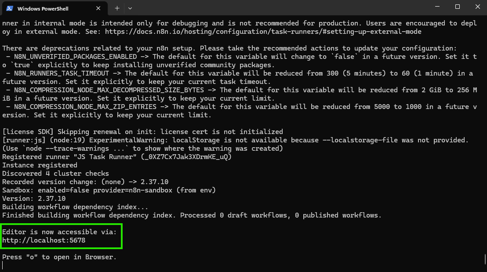
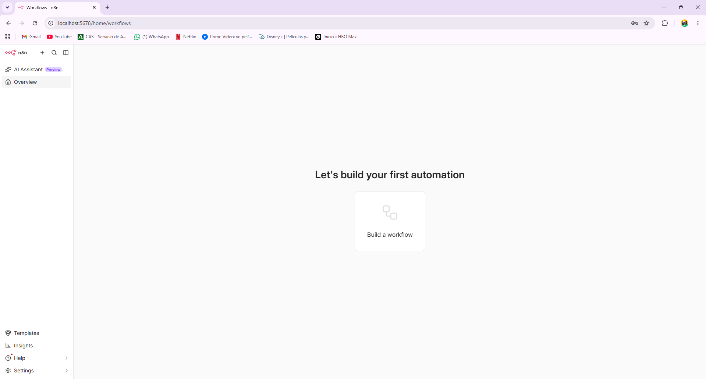
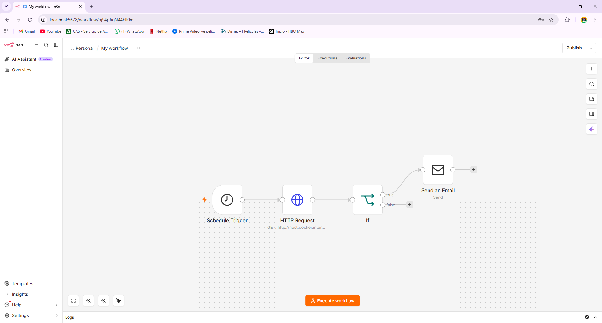
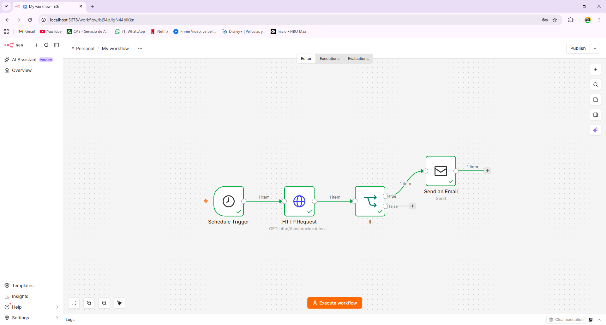
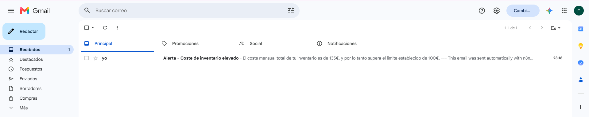
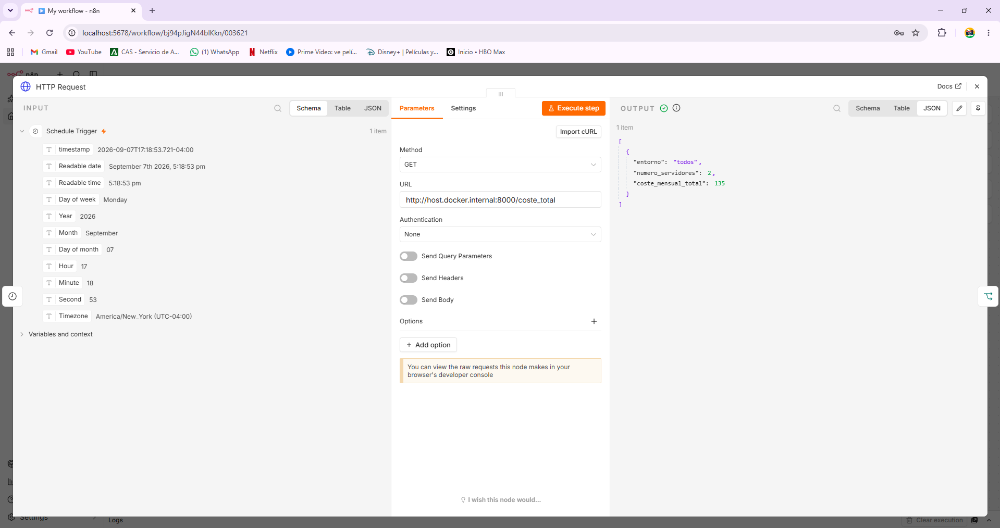
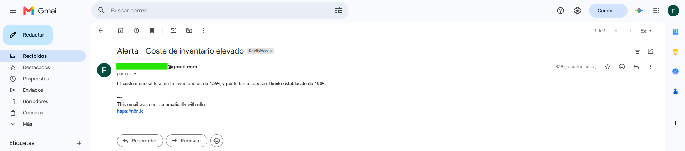
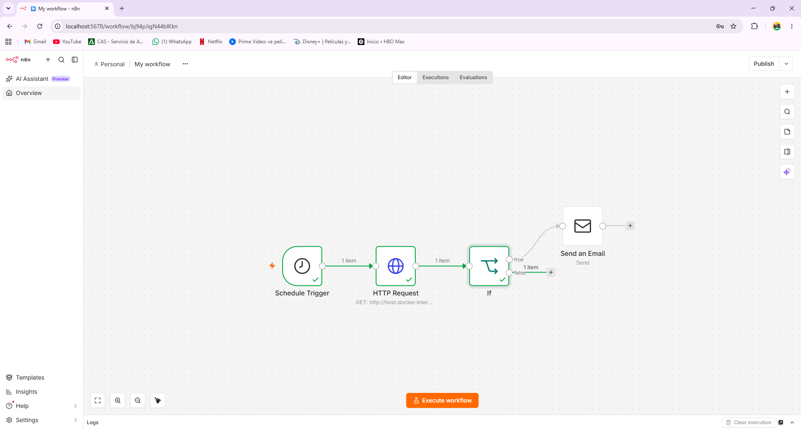
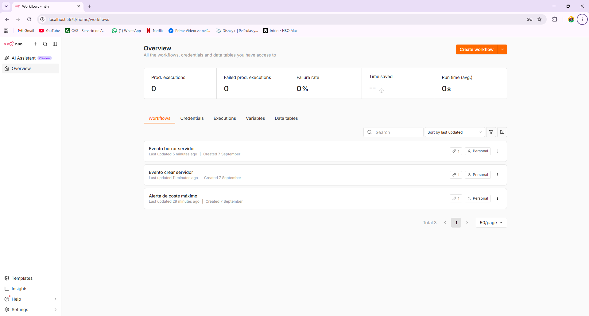

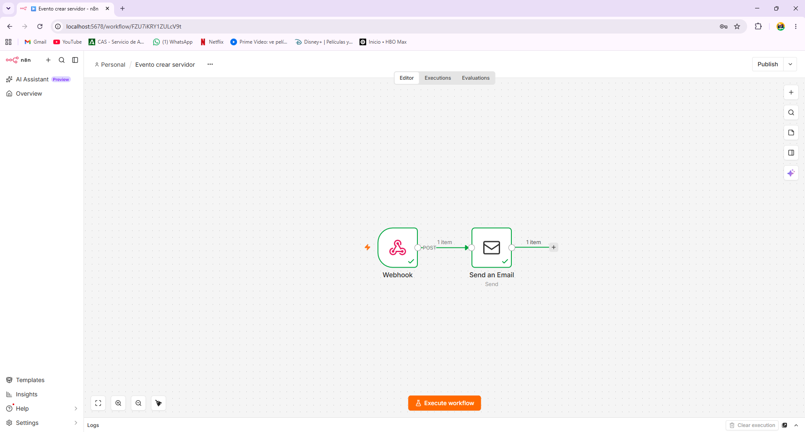
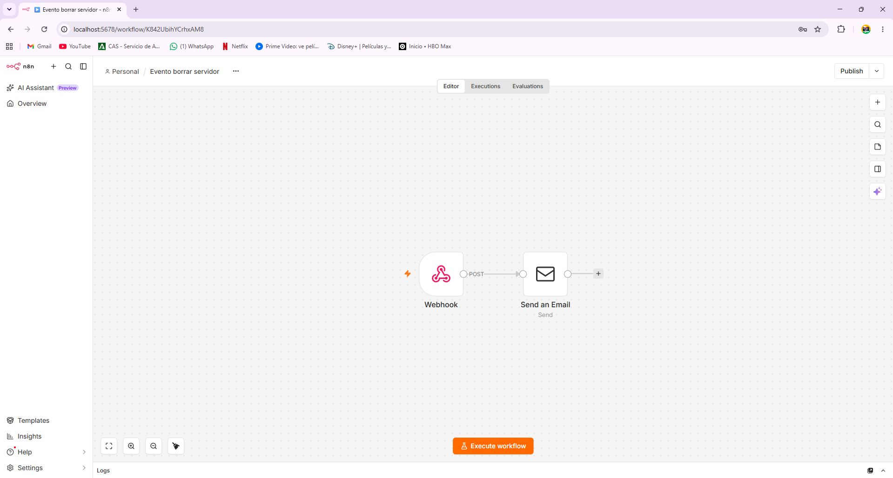

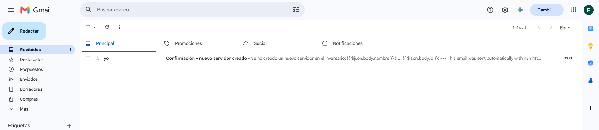
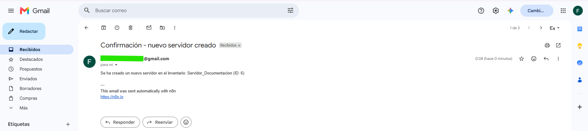
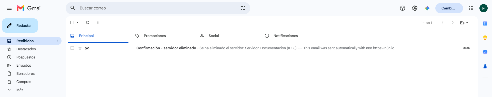
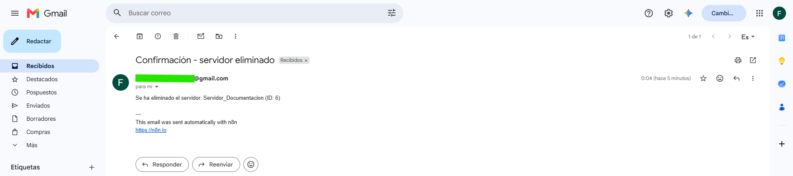

## 📁 Estructura del proyecto
```
automatizacion-api-inventario-n8n/
├── flujos/
│ ├── alerta-coste.json
│ ├── confirmacion-crear-servidor.json
│ └── confirmacion-borrar-servidor.json
├── capturas/
└── README.md
```
## ⚙️ Si quieres probarlo tú mismo

1. Levanta n8n con Docker:
```bash
   docker run -it --rm --name n8n -p 5678:5678 -v n8n_data:/home/node/.n8n docker.n8n.io/n8nio/n8n
```
2. Importa los flujos que tengo en la carpeta `flujos/` a tu propia instancia de n8n
3. Pon tus propias credenciales de email (Gmail u otro) en los nodos de "Send Email"
4. Ejecuta mi API del inventario en local (está en [`inventario-cloud-fastapi`](https://github.com/FJMurOrt/inventario-cloud-fastapi))
5. Activa los 3 flujos

**Nota:** en los archivos JSON de los flujos, sustituí mi email real por `tuemail@gmail.com`. Si los importas, tendrás que poner tu propia dirección y configurar tus propias credenciales SMTP.

## 🛠️ Tecnologías que se han usado

- n8n
- Docker
- Webhooks
- Email por SMTP (Gmail)
- FastAPI (mi API a la que está conectado)
